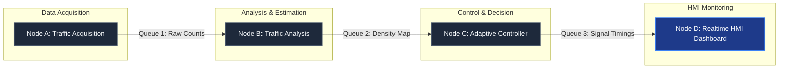
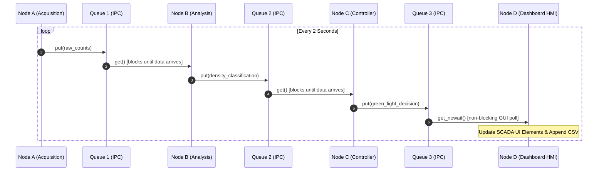
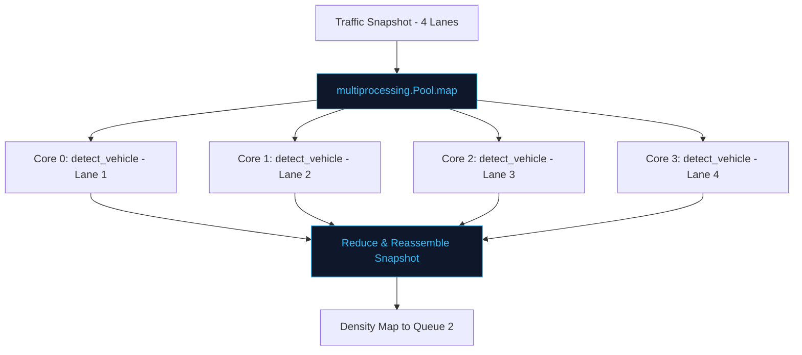
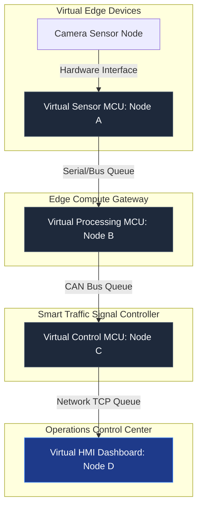

# Distributed Smart Traffic Simulator

## KELOMPOK DACE IFB-206 KOMPUTASI PARAREL&SYSTEM TERDISTRIBUSI

- **Member 1** : Darent Glusefik - 152024172
- **Member 2** : Cepin Marsal JHD - 152024056
- **Member 3** : Putri Yudi P - 152024035

---

> **Parallel Computing & Distributed Systems Simulation**

[](https://www.python.org/)
[](https://www.riverbankcomputing.com/software/pyqt/)
[](https://matplotlib.org/)
[](LICENSE)
[]()

---

## 1. Project Overview

The **Distributed Smart Traffic Simulator** is an advanced, industrial-grade simulation system designed to model a smart city's traffic management control center. Developed as a final project for the **Parallel Computing and Distributed Systems** course, this system highlights the practical application of:

- **Parallel Computing**: Simulating simultaneous multi-lane traffic detection by distributing workload processing across separate CPU cores.
- **Distributed Processing & IPC**: Separating system responsibilities into individual virtual nodes that communicate asynchronously via multiprocessing queues.
- **Virtual Embedded Architecture**: Modeling hardware boundaries (Sensors, MCUs, HMIs) virtually through independent, isolated python processes.
- **Realtime SCADA Interface**: Providing a high-fidelity monitoring HMI (Human-Machine Interface) for system telemetry, analytics, logging, and benchmarking.

By combining these paradigms, the simulator demonstrates how modern smart city infrastructures scale handling of high-frequency spatial-temporal sensor data while preserving low-latency controller feedback loops.

---

## 2. Key Features

- **Distributed Queue Pipeline**: Implements sequential processing across 4 virtual nodes connected through standard inter-process communication (IPC) messaging queues.
- **Parallel Spatial Processing**: Evaluates lane traffic volumes concurrently using process pools to simulate multi-sensor camera feeds.
- **Real-time SCADA HMI**: Features a custom dark-themed GUI matching industrial smart city dashboard standards, built on PyQt5.
- **Adaptive Signal Control**: Uses controller node logic to dynamically compute green light timing durations based on evaluated traffic densities.
- **Interactive Data Flow Visualizer**: Sequence highlights nodes and arrows in the architecture diagram to represent packet propagation through queues in real-time.
- **Non-Blocking Performance Benchmark**: Runs performance tests (Sequential vs. Parallel Pool execution) in a background thread to prevent UI freezing.
- **Traffic Logging**: Automatically writes historical logs to a structured CSV file asynchronously.
- **Traffic Analytics Panel**: Displays system throughput, peak lane volume, and average vehicle counts.

---

## 3. System Architecture

The simulation operates as a linear distributed pipeline. Traffic data is acquired, analyzed, controlled, and visualised across 4 distinct processing units:



### Node Description

| Node Identifier | Name                | Responsibility                                                                    | Output Channel                 |
| :-------------- | :------------------ | :-------------------------------------------------------------------------------- | :----------------------------- |
| **Node A**      | Traffic Acquisition | Simulates mock cameras generating vehicle counts across 4 lanes.                  | Queue 1 (Raw Vehicle Count)    |
| **Node B**      | Traffic Analysis    | Evaluates vehicle counts to determine lane congestion levels (LOW, MEDIUM, HIGH). | Queue 2 (Analyzed Density)     |
| **Node C**      | Adaptive Controller | Applies timing rules to allocate green light cycles based on density.             | Queue 3 (Timing Decision Data) |
| **Node D**      | Realtime Dashboard  | Renders telemetry graphs, updates stats cards, and appends logs.                  | HMI Screen & CSV Logs          |

---

## 4. Distributed System Design

To represent physical distributed computers, every node is decoupled and runs inside its own OS process. Communication is strictly queue-based, enforcing unidirectional messaging and avoiding shared-memory state hazards:



- **Asynchronous IPC**: Queues act as intermediate message brokers. Even if Node B experiences a calculation spike, Node A continues loading Queue 1 safely.
- **Non-Blocking GUI Integration**: Node D polls Queue 3 using a non-blocking `get_nowait()` method on a `QTimer` tick. This keeps the GUI rendering at 60 FPS while checking for incoming network data.

---

## 5. Parallel Computing Implementation

Node B simulates computer-vision-based vehicle detection. Processing 4 lanes sequentially on a single core represents a bottleneck. The system leverages CPU parallelism by mapping lane evaluations concurrently across a process worker pool:



This ensures that spatial calculations are performed simultaneously, reducing the processing latency from $O(N)$ (sequential) to $O(1)$ (parallel, where $N \le \text{available cores}$).

---

## 6. Virtual Embedded System Architecture

The software components are mapped directly to mimic real microcontroller unit (MCU) hardware boundaries, simulating a physical IoT architecture:



- **Virtual Sensor MCU**: Handles hardware interfaces (Frame acquisition).
- **Virtual Processing MCU**: Simulates GPU acceleration/processing at the edge gateway.
- **Virtual Control MCU**: Acts as the physical traffic light relay microcontroller.
- **Virtual HMI Dashboard**: The SCADA display console inside the central control room.

---

## 7. Dashboard Features

The Human-Machine Interface (HMI) provides an industrial control dashboard panel:

1.  **SCADA Header Controls**: Displays system statuses and allows toggling between **Live Queue Mode** (real parallel multiprocessing pipeline) and **Standalone Simulation Mode** (local UI generation).
2.  **Lane Status Cards**: Displays vehicle counts, green light duration, status (LOW, MEDIUM, HIGH), and progress bars visualizing density levels.
3.  **Matplotlib History Chart**: Plots historical vehicle volumes across all lanes for the last 10 updates, styled with transparency to fit the dark theme.
4.  **System Node LEDs**: 3D radial-gradient status LEDs representing active processes.
5.  **Distributed Pipeline Flowchart**: Flashes a cyan lighting wave sequentially as data travels between queues and nodes.
6.  **Parallel Performance Panel**: Shows metrics (Sequential time, Parallel time, Speedup, and Efficiency) generated from running the benchmark.
7.  **Traffic Analytics Card**: Telemetry calculations displaying Peak Traffic Lane, Average Vehicles, Highest Density Lane, and System Throughput.

---

## 8. Benchmark Results

The system includes a benchmarking module evaluating execution time differences between sequential loops and parallel process pools:

| Metric                        | Measured Value   | Analysis & Performance Demonstration                                                                                                                                                     |
| :---------------------------- | :--------------- | :--------------------------------------------------------------------------------------------------------------------------------------------------------------------------------------- |
| **Sequential Execution Time** | `2.0011` seconds | Simulates processing 4 lanes sequentially on a single thread. Since each mock detection takes 0.5s, the total sequential overhead is $\approx 2.0\text{s}$.                              |
| **Parallel Execution Time**   | `0.6582` seconds | Evaluates 4 lanes simultaneously across 4 independent CPU workers. Total time is $\approx 0.5\text{s}$ (the duration of 1 detection task) + process spawning overhead.                   |
| **System Speedup**            | `3.04x`          | Displays the speedup ratio ($T_{seq} / T_{par}$). A speedup of `3.04` demonstrates significant core utilization.                                                                         |
| **System Efficiency**         | `76.01%`         | Displays core utilization efficiency ($\text{Speedup} / \text{Cores} \times 100\%$). An efficiency of `76.01%` is typical for Windows environments due to process pool startup overhead. |
| **CPU Worker Cores**          | `4 Cores`        | Represents the number of concurrent processes allocated for parallel execution.                                                                                                          |

_Note: Visual indicators automatically apply color highlights based on calculations: Speedup $>2.5x$ is highlighted green, and Efficiency $>70\%$ is highlighted green._

---

## 9. Traffic Analytics & Logging

### Asynchronous CSV Logging

To maintain system accountability and support historical audits, the dashboard saves incoming data into a structured CSV file. The file is created automatically if missing:

- **Location**: `logs/traffic_log.csv`
- **CSV Headers**: `timestamp,lane,vehicles,density,green_time`

To ensure logging write bottlenecks never block GUI rendering, logging writes are delegated to an independent asynchronous **daemon thread** executing in the background.

### Telemetry Computations

- **Peak Traffic Lane**: The lane displaying the largest vehicle count in the current cycle.
- **Average Vehicle Count**: Sum of vehicle volumes divided by the number of lanes.
- **Highest Density Lane**: Displays the lane currently marked `HIGH` containing the largest vehicle volume.
- **System Throughput**: Measures packet frequency in packets/second dynamically using a rolling window of the last 10 seconds.

---

## 10. Installation & Requirements

### Prerequisites

- **Python 3.10+** (Ensure Python is added to the system environment path)
- **OS Support**: Windows, Linux, or macOS (tested on Windows 11)

### Package Dependencies

The simulation utilizes PyQt5 and Matplotlib. Install them using standard pip:

```bash
pip install PyQt5 matplotlib
```

---

## 11. How To Run

Ensure you are located inside the root project directory

### A. Full Distributed Pipeline Mode (Primary Execution)

To launch Node A, B, and C as separate parallel processes communicating with the GUI Dashboard via IPC queues:

```bash
python run_system.py
```

- **Behavior**: You will see logs printing in the console from Node A, B, and C as they boot, process, and forward queue packets. The GUI will open in **LIVE QUEUE MODE**.
- **Clean Exit**: Closing the GUI window automatically signals background processes to stop and terminates them cleanly.

### B. Standalone Demo Mode (Local UI Simulation)

To run the dashboard GUI standalone (for presentation or testing without launching background processes):

```bash
python dashboard_gui.py
```

- **Behavior**: The GUI will open in **STANDALONE SIMULATION** mode, running local timers to generate random vehicle counts every 2 seconds, passing the data through simulated nodes, and animating the layout.

---

## 12. Project Structure

```
EVALUASI3/
│
├── main.py                     # Initial single-run project launcher
├── run_system.py               # Live concurrent multi-process controller & launcher
├── dashboard_gui.py            # Main PyQt5 SCADA HMI Dashboard & layout controls
│
├── benchmark/
│   └── performance_test.py     # Multiprocessing benchmark module
│
├── nodes/
│   ├── acquisition_node.py     # Node A: Traffic volume generator
│   ├── analysis_node.py        # Node B: Traffic density estimator
│   ├── controller_node.py      # Node C: Adaptive signal light controller
│   ├── dashboard_node.py       # Node D: Legacy console dashboard printer
│   └── detection_node.py       # Parallel core helper simulating CV detection workloads
│
├── simulator/
│   └── traffic_generator.py    # Random vehicle count data simulation
│
└── logs/
│   └── traffic_log.csv         # Automatically generated CSV telemetry log
└── docs/
    ├── dashboard.png
    ├── architecture.png
    ├── parallel.png
    ├── benchmark.txt
    ├── analytics.png
    ├── simulation_mode.png
    ├── traffic_logging.png
```

Presented inside a clean, modern SCADA HMI dashboard, this project stands as a fully integrated showcase of **Parallel Computing** and **Distributed Systems** principles.
